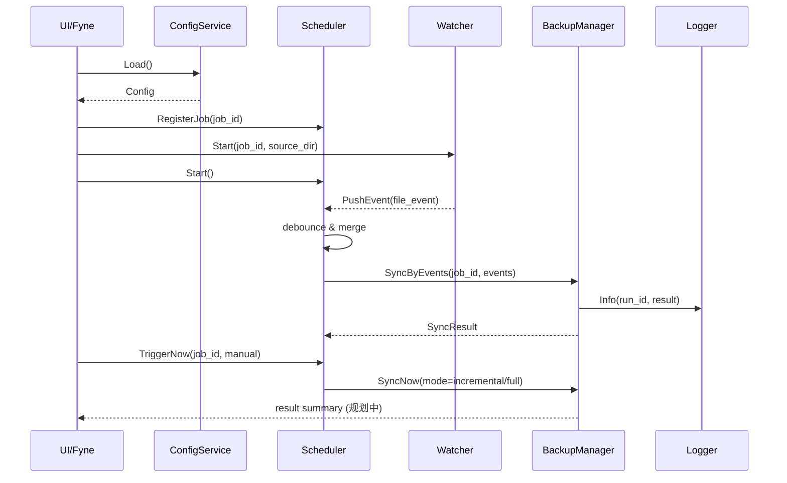

# LiteSync 内部模块接口约定（规划中）

> 本文定义 LiteSync 的内部模块接口草案，用于指导后续 Go 实现。  
> 当前为文档阶段，接口名称和字段可能在实现前小幅调整，但语义应保持一致。

## 1. 约定目标

- 明确模块边界，减少并行开发冲突。
- 约束输入/输出与错误语义，避免隐式行为。
- 明确幂等性与并发规则，降低竞态风险。

## 2. 通用类型（Go 风格伪代码）

```go
package api

import "context"
import "time"

type JobID string
type RunID string
type RequestID string

type TriggerReason string

const (
    TriggerStartup   TriggerReason = "startup"
    TriggerFileEvent TriggerReason = "file_event"
    TriggerSchedule  TriggerReason = "schedule"
    TriggerManual    TriggerReason = "manual"
    TriggerReconcile TriggerReason = "reconcile"
)

type SyncMode string

const (
    SyncModeFull        SyncMode = "full"
    SyncModeIncremental SyncMode = "incremental"
)

type FileOp string

const (
    FileCreate FileOp = "create"
    FileWrite  FileOp = "write"
    FileRemove FileOp = "remove"
    FileRename FileOp = "rename"
    FileChmod  FileOp = "chmod"
)

type ConflictPolicy string

const (
    ConflictOverwrite            ConflictPolicy = "overwrite"
    ConflictBackupThenOverwrite  ConflictPolicy = "backup_then_overwrite"
    ConflictSkip                 ConflictPolicy = "skip"
)

type DeletePolicy string

const (
    DeletePropagate DeletePolicy = "propagate"
    DeleteSoftDelete DeletePolicy = "soft_delete"
    DeleteIgnore     DeletePolicy = "ignore"
)

type SyncRequest struct {
    JobID        JobID
    RequestID    RequestID
    Reason       TriggerReason
    Mode         SyncMode
    ChangedPaths []string
    Force        bool
    RequestedAt  time.Time
}

type SyncResult struct {
    JobID          JobID
    RunID          RunID
    StartedAt      time.Time
    FinishedAt     time.Time
    CopiedFiles    uint64
    UpdatedFiles   uint64
    DeletedFiles   uint64
    SkippedFiles   uint64
    ConflictCount  uint64
    ErrorCount     uint64
}

type FileEvent struct {
    JobID      JobID
    Path       string
    Op         FileOp
    IsDir      bool
    OccurredAt time.Time
}
```

## 3. 错误语义约定

建议统一错误码，便于日志聚合与 UI 提示（规划中）：

| 错误码 | 含义 | 是否可重试 |
| --- | --- | --- |
| `ErrInvalidArgument` | 入参不合法 | 否 |
| `ErrJobNotFound` | 任务不存在 | 否 |
| `ErrAlreadyRunning` | 同任务已有同步执行中 | 是（稍后重试） |
| `ErrPermissionDenied` | 文件或自启动权限不足 | 否（需用户处理） |
| `ErrIOTransient` | 临时 IO 异常（占用、瞬时失败） | 是 |
| `ErrConflictDetected` | 检测到源/目标冲突 | 取决于策略 |
| `ErrNotSupported` | 当前平台不支持某能力 | 否 |
| `ErrInternal` | 内部错误 | 视情况 |

## 4. 模块接口

## 4.1 BackupManager（全量/增量同步触发）

### 接口草案

```go
type BackupManager interface {
    // SyncNow 用于手动、启动或调度触发；Mode 决定全量或增量。
    SyncNow(ctx context.Context, req SyncRequest) (SyncResult, error)

    // SyncByEvents 根据事件列表执行增量同步。
    SyncByEvents(ctx context.Context, jobID JobID, events []FileEvent, reason TriggerReason) (SyncResult, error)

    // Reconcile 周期性全量校验并补偿监听遗漏。
    Reconcile(ctx context.Context, jobID JobID) (SyncResult, error)

    // Cancel 请求取消正在执行的 run。
    Cancel(ctx context.Context, runID RunID) error
}
```

### 输入参数与返回值

| 方法 | 输入 | 返回 |
| --- | --- | --- |
| `SyncNow` | `SyncRequest` | `SyncResult, error` |
| `SyncByEvents` | `jobID, []FileEvent, reason` | `SyncResult, error` |
| `Reconcile` | `jobID` | `SyncResult, error` |
| `Cancel` | `runID` | `error` |

### 错误语义

- 任务不存在：`ErrJobNotFound`
- 同任务并发执行：`ErrAlreadyRunning`
- 单文件失败不应直接终止整个任务；汇总到 `SyncResult.ErrorCount`，最终错误可为 `nil` 或聚合错误（规划中统一）

### 幂等性/并发注意点

- 同一 `job_id + request_id` 的重复 `SyncNow` 应幂等去重（规划中）。
- 同一 `job_id` 任一时刻仅允许一个活动 `run_id`。
- `Cancel` 对已结束 run 应返回 `nil`（幂等）。

## 4.2 Watcher（文件变化监听）

### 接口草案

```go
type Watcher interface {
    // Start 为任务建立监听。
    Start(ctx context.Context, jobID JobID, sourceDir string) error

    // Stop 停止任务监听。
    Stop(ctx context.Context, jobID JobID) error

    // Events 输出标准化事件流。
    Events() <-chan FileEvent

    // Errors 输出监听错误流（由上层调度处理）。
    Errors() <-chan error
}
```

### 输入参数与返回值

| 方法 | 输入 | 返回 |
| --- | --- | --- |
| `Start` | `jobID, sourceDir` | `error` |
| `Stop` | `jobID` | `error` |
| `Events` | 无 | `<-chan FileEvent` |
| `Errors` | 无 | `<-chan error` |

### 错误语义

- 重复启动同任务：建议返回 `nil`（幂等）或 `ErrAlreadyRunning`，实现需统一（规划中建议返回 `nil`）。
- 无效目录/无权限：`ErrInvalidArgument` / `ErrPermissionDenied`

### 幂等性/并发注意点

- `Start` 与 `Stop` 需线程安全。
- 事件通道由 Watcher 拥有并管理关闭时机；调用方不得主动关闭。
- 事件可能丢失或合并，必须与 `Reconcile` 配套。

## 4.3 Scheduler（定时或事件驱动同步）

### 接口草案

```go
type Scheduler interface {
    RegisterJob(ctx context.Context, jobID JobID) error
    UnregisterJob(ctx context.Context, jobID JobID) error

    // PushEvent 由 Watcher 回调进入调度队列。
    PushEvent(ctx context.Context, event FileEvent) error

    // TriggerNow 由 UI 或命令触发立即同步。
    TriggerNow(ctx context.Context, jobID JobID, reason TriggerReason) (RunID, error)

    Start(ctx context.Context) error
    Stop(ctx context.Context) error
}
```

### 输入参数与返回值

| 方法 | 输入 | 返回 |
| --- | --- | --- |
| `RegisterJob` | `jobID` | `error` |
| `PushEvent` | `FileEvent` | `error` |
| `TriggerNow` | `jobID, reason` | `RunID, error` |
| `Start/Stop` | 无 | `error` |

### 错误语义

- 调度器未启动：`ErrInternal`（或状态错误，规划中）
- 未注册任务：`ErrJobNotFound`

### 幂等性/并发注意点

- `Start`/`Stop` 应幂等。
- 同任务事件应做防抖聚合（`debounce_ms`）。
- 对同任务提交同步时必须保证串行执行。

## 4.4 ConfigService（配置读写）

### 接口草案

```go
type ConfigService interface {
    Load(ctx context.Context) (Config, error)
    Save(ctx context.Context, cfg Config) error
    Validate(cfg Config) error

    // Watch 返回配置变更通知（文件变化或内部更新）。
    Watch(ctx context.Context) (<-chan Config, error)
}
```

### 输入参数与返回值

| 方法 | 输入 | 返回 |
| --- | --- | --- |
| `Load` | 无 | `Config, error` |
| `Save` | `Config` | `error` |
| `Validate` | `Config` | `error` |
| `Watch` | 无 | `<-chan Config, error` |

### 错误语义

- 配置格式错误：`ErrInvalidArgument`
- 无法持久化：`ErrIOTransient` 或 `ErrPermissionDenied`

### 幂等性/并发注意点

- `Save` 建议采用原子写（临时文件 + rename）。
- `Watch` 回调触发后由上层判断热更新或重启任务。

## 4.5 StartupService（开机自启控制）

### 接口草案

```go
type StartupStatus struct {
    Enabled  bool
    Provider string // windows_run_registry | macos_launch_agent | linux_autostart_desktop
}

type StartupService interface {
    Enable(ctx context.Context) error
    Disable(ctx context.Context) error
    Status(ctx context.Context) (StartupStatus, error)
}
```

### 输入参数与返回值

| 方法 | 输入 | 返回 |
| --- | --- | --- |
| `Enable` | 无 | `error` |
| `Disable` | 无 | `error` |
| `Status` | 无 | `StartupStatus, error` |

### 错误语义

- 平台不支持：`ErrNotSupported`
- 权限不足：`ErrPermissionDenied`

### 幂等性/并发注意点

- `Enable`/`Disable` 应幂等。
- 需避免重复写入多条自启记录。

## 4.6 Logger（日志与错误分级）

### 接口草案

```go
type Field struct {
    Key   string
    Value any
}

type Logger interface {
    Debug(msg string, fields ...Field)
    Info(msg string, fields ...Field)
    Warn(msg string, fields ...Field)
    Error(msg string, err error, fields ...Field)

    With(fields ...Field) Logger
    Sync() error
}
```

### 输入参数与返回值

| 方法 | 输入 | 返回 |
| --- | --- | --- |
| `Debug/Info/Warn` | `msg, fields` | 无 |
| `Error` | `msg, err, fields` | 无 |
| `With` | `fields` | `Logger` |
| `Sync` | 无 | `error` |

### 错误语义

- 日志写入失败不应阻塞主流程，但应有降级记录（例如 stderr，规划中）。

### 幂等性/并发注意点

- Logger 实现必须支持并发写入。
- `With` 返回子 logger，避免共享可变状态。

## 5. 典型调用流程（时序）



## 6. 版本与兼容约束

- 接口版本：`v0`（文档草案）
- 破坏性变更规则（规划中）：
  - 修改函数签名或字段语义时，必须同步更新 `docs/ARCHITECTURE.md` 与 `docs/CONFIG.md`。
  - 对外可见行为变更必须记录在 `docs/ROADMAP.md`。
