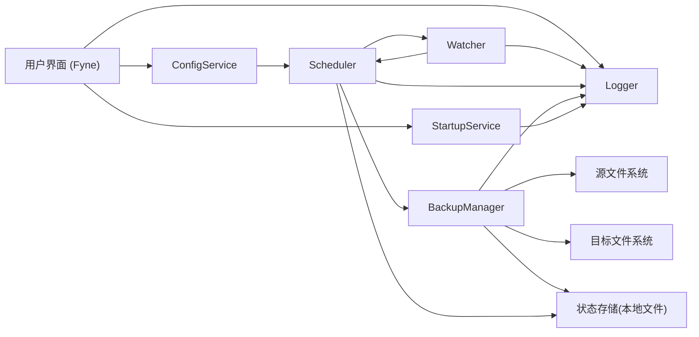
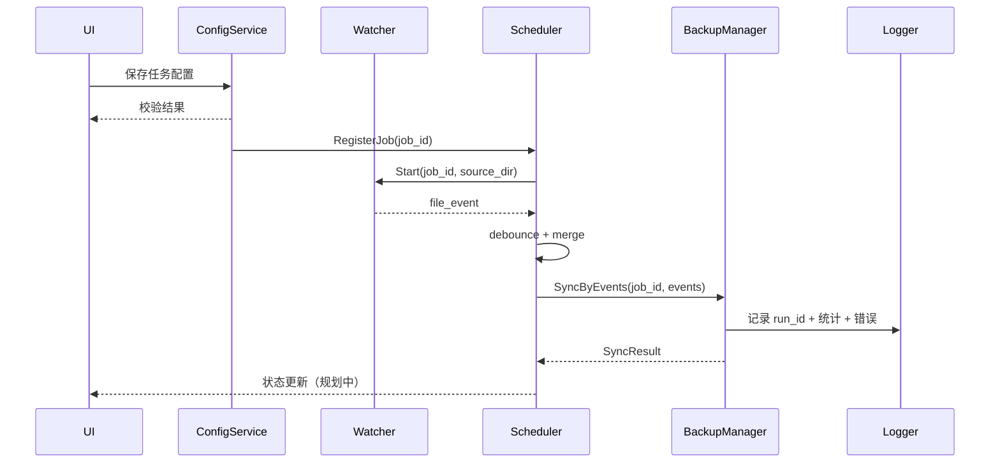

# LiteSync 架构设计（规划中）

> 本文描述 LiteSync 的目标架构、模块职责、数据流和关键策略，用于指导后续实现。

## 1. 架构目标

- 一方向同步：以源目录为准，将变更同步到目标目录。
- 低打扰：后台常驻、事件驱动、必要时周期补偿。
- 可恢复：异常中断后可恢复运行并可追踪问题。
- 跨平台一致性：在 Windows/macOS/Linux 提供尽可能一致的行为。

## 2. 总体架构图

## 3. 模块职责划分

| 模块 | 主要职责 | 不负责内容 |
| --- | --- | --- |
| `UI (Fyne)` | 任务配置、状态展示、手动触发、退出控制 | 直接文件复制 |
| `ConfigService` | 加载/校验/保存配置、配置变更通知 | 同步执行 |
| `Watcher` | 监听源目录文件变化并产出标准事件 | 冲突决策 |
| `Scheduler` | 防抖、事件聚合、任务串行化、触发同步 | 文件读写 |
| `BackupManager` | 全量/增量同步、冲突处理、重试 | UI 交互 |
| `StartupService` | 开机自启启停与状态查询 | 任务调度 |
| `Logger` | 日志分级、上下文关联（`job_id/run_id`） | 业务决策 |
| `状态存储` | 保存任务运行状态、补偿校验信息 | 长期数据库能力 |

## 4. 数据流

## 4.1 主流程

1. 用户在 UI 选择源目录和目标目录，并保存配置。
2. `ConfigService` 校验配置并通知 `Scheduler` 注册任务。
3. `Watcher` 监听源目录变化，向 `Scheduler` 推送事件。
4. `Scheduler` 做防抖与批处理后触发 `BackupManager`。
5. `BackupManager` 执行增量同步（必要时全量/校验同步）。
6. 同步结果与错误写入 `Logger`，并更新本地状态。

## 4.2 时序图

## 5. 同步策略设计

## 5.1 首次全量同步

- 触发条件：
  - 新任务首次启动
  - 状态快照不存在或损坏
  - 用户手动触发全量同步
- 行为：
  - 递归扫描源目录
  - 根据排除规则过滤
  - 在目标目录创建/更新缺失文件

## 5.2 后续增量同步

- 触发条件：
  - Watcher 事件（新增/修改/删除/重命名）
  - 调度器手动触发
- 行为：
  - 事件按 `debounce_ms` 聚合
  - 同路径多事件折叠为最终动作
  - 单任务串行执行，避免并发覆盖

## 5.3 周期校验（Reconcile）

- 目的：补偿监听漏事件、修复漂移。
- 建议默认：每 `30` 分钟（可配置）执行轻量校验。
- 校验结果：
  - 一致：记录摘要即可
  - 不一致：触发补偿同步并记录原因

## 6. 冲突处理策略

> 冲突定义：目标目录对应文件与源目录不一致，且不能通过普通增量逻辑直接判定为同一次变更链路。

建议默认策略：`backup_then_overwrite`。

| 策略 | 行为 | 适用场景 | 风险 |
| --- | --- | --- | --- |
| `overwrite` | 直接用源覆盖目标 | 追求强一致、可接受目标改动丢失 | 可能覆盖用户在目标侧修改 |
| `backup_then_overwrite` | 先备份目标冲突文件再覆盖 | 默认推荐，兼顾一致性与可恢复 | 额外占用空间 |
| `skip` | 跳过冲突文件并告警 | 谨慎同步场景 | 目标可能长期不一致 |

## 7. 跨平台差异点

| 维度 | Windows | macOS | Linux |
| --- | --- | --- | --- |
| 文件事件后端 | `ReadDirectoryChangesW`（经 fsnotify） | `FSEvents/kqueue`（经 fsnotify） | `inotify`（经 fsnotify） |
| 路径分隔符 | `\` | `/` | `/` |
| 大小写敏感 | 默认不敏感 | 视文件系统而定 | 通常敏感 |
| 自启动机制 | 注册表 `Run` 或计划任务 | `LaunchAgents` | `~/.config/autostart` 或 `systemd --user` |
| 权限模型 | UAC/ACL | 沙箱与目录授权差异 | 发行版与挂载权限差异 |

跨平台统一建议：

- 内部统一使用规范化绝对路径（保存前清洗）。
- 路径比较加入大小写策略开关（默认按平台行为）。
- 监听能力永远配合周期校验，不依赖单一事件机制。

## 8. 非目标与边界

- 当前非目标（v1.0 前）：
  - 双向同步
  - 云端同步
  - 分布式多节点一致性
- 边界策略：
  - 以“可恢复、可排障”优先于“绝对实时”
  - 可观察性优先于隐藏错误
